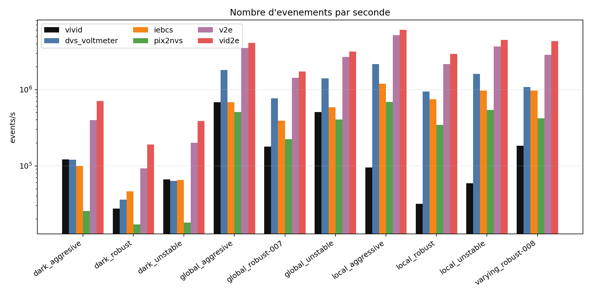
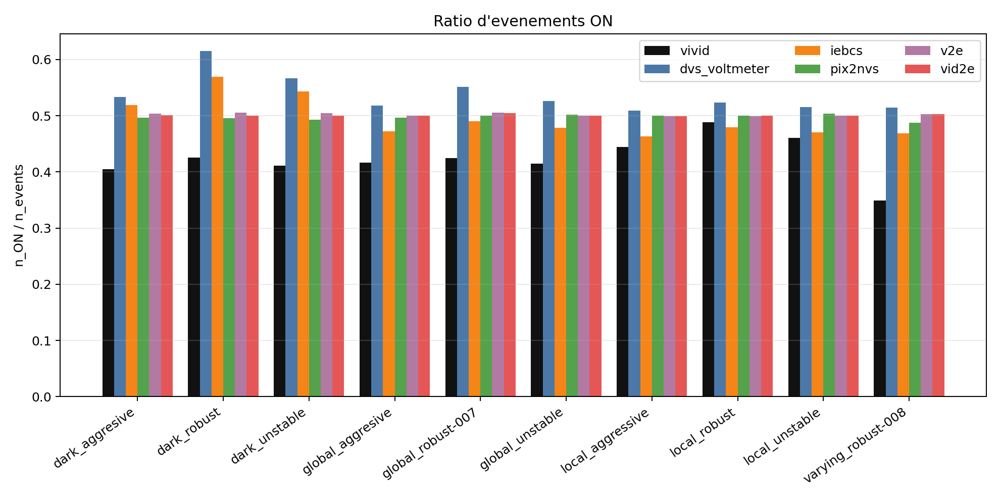
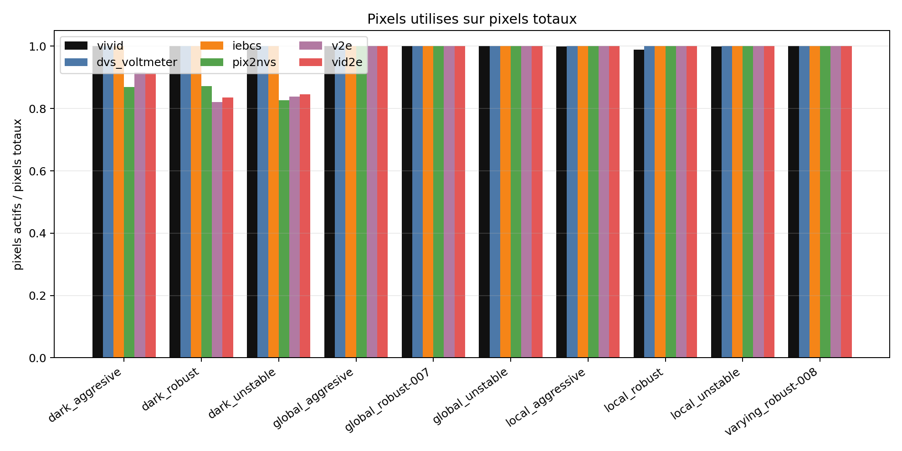
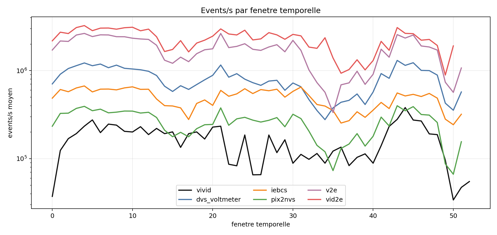

# Comparaison DVS réel / simulateurs avec ViViD++

Ce projet permet de préparer le dataset ViViD++, de lancer plusieurs simulateurs DVS, de convertir tous les événements dans un format commun, puis de comparer les événements simulés aux événements réels.

Objectif :

```text
RGB ViViD++ -> simulateurs -> événements simulés
DVS ViViD++ -> événements réels de référence
comparaison réel vs simulé
```

## Pipeline complète

La pipeline suit quatre étapes :

```text
1. extraction du dataset depuis les fichiers .bag ViViD++
2. lancement des simulateurs vidéo -> événements
3. conversion des sorties au format AER commun
4. comparaison fondamentale des événements réels et simulés
```

Le format final utilisé dans le projet est :

```text
x, y, t, p
```

avec :

```text
x = coordonnée horizontale
y = coordonnée verticale
t = temps en secondes
p = polarité : 0 = OFF, 1 = ON
```

## Architecture

```text
.
├── README.md
├── requirements.txt
├── environment.yml
├── run_all.sh
├── config/
│   └── pipeline_config.example.yaml
├── dataset_pipeline/
├── run_vivid_event_pipeline.py
├── adapters/
├── scripts/
│   ├── 00_check_project.py
│   ├── 02_convert_simulator_outputs_to_aer_npz.py
│   ├── 03_prepare_vivid_real_events_to_aer_npz.py
│   └── 04_compare_fundamental_metrics.py
├── docs/
│   ├── DATASET_PIPELINE.md
│   ├── DATA_LAYOUT.md
│   ├── INSTALL_SIMULATORS.md
│   ├── METRICS.md
│   └── example_comparison/
├── data/
├── external/
└── runs/
```

## Installation

Avec conda :

```bash
conda env create -f environment.yml
conda activate vivid-dvs-comparison
```

Avec pip :

```bash
pip install -r requirements.txt
```

Installer également FFmpeg :

```bash
sudo apt install ffmpeg
```

## Configuration

Créer la configuration locale :

```bash
cp config/pipeline_config.example.yaml config/pipeline_config.yaml
```

Modifier ensuite les chemins dans :

```text
config/pipeline_config.yaml
```

Les simulateurs doivent être installés séparément, par exemple dans :

```text
external/
├── v2e/
├── rpg_vid2e/
├── IEBCS/
├── DVS-Voltmeter/
└── PIX2NVS/
```

## Étape 1 — Extraction du dataset ViViD++

Cette étape est nécessaire lorsque les données d’origine sont des fichiers `.bag`.

```bash
python dataset_pipeline/run_pipeline.py data/raw_bags --out data/outputs
```

Sortie attendue :

```text
data/outputs/<sequence>/
├── frames_rgb/
├── events/
├── timestamps/
└── videos/
```

Pour inspecter les topics d’un bag :

```bash
python dataset_pipeline/inspect_bag.py data/raw_bags/sequence.bag
```

## Étape 2 — Préparation et simulation

Préparer les séquences :

```bash
python run_vivid_event_pipeline.py --config config/pipeline_config.yaml --prepare
```

Lancer tous les simulateurs :

```bash
python run_vivid_event_pipeline.py --config config/pipeline_config.yaml --run all
```

Lancer un seul simulateur :

```bash
python run_vivid_event_pipeline.py --config config/pipeline_config.yaml --run iebcs
```

## Étape 3 — Conversion au format commun

Convertir les sorties des simulateurs :

```bash
python scripts/02_convert_simulator_outputs_to_aer_npz.py --config config/pipeline_config.yaml
```

Préparer les événements réels ViViD++ :

```bash
python scripts/03_prepare_vivid_real_events_to_aer_npz.py --config config/pipeline_config.yaml
```

Structure obtenue :

```text
runs/aer_npz/
├── vivid/
├── v2e/
├── vid2e/
├── iebcs/
├── dvs_voltmeter/
└── pix2nvs/
```

## Étape 4 — Comparaison fondamentale

Le script de comparaison utilisé est :

```text
scripts/04_compare_fundamental_metrics.py
```

Commande :

```bash
python scripts/04_compare_fundamental_metrics.py runs/aer_npz runs/comparison
```

La pipeline complète l’appelle automatiquement avec :

```bash
bash run_all.sh
```

Le script calcule quatre métriques principales :

```text
events/s
events/pixel
ratio ON
pixels actifs / pixels totaux
```

Deux contrôles temporels sont ajoutés :

```text
délai inter-événement moyen par pixel
events/s par fenêtre temporelle
```

### Formules

```text
events/s = n_events / durée
events/pixel = n_events / (largeur * hauteur)
ON ratio = n_ON / n_events
pixels utilisés = pixels_actifs / pixels_totaux
délai_pixel = (t_dernier - t_premier) / (n_events_pixel - 1)
```

Le délai inter-événement est calculé seulement pour les pixels ayant au moins deux événements.

## Sorties de la comparaison

```text
runs/comparison/
├── RAPPORT.md
├── README.md
├── requirements.txt
├── figures/
│   ├── 01_events_per_second.png
│   ├── 02_events_per_pixel.png
│   ├── 03_on_fraction.png
│   ├── 04_active_pixel_fraction.png
│   ├── 05_delay_inter_event_per_pixel.png
│   └── 06_events_per_second_by_temporal_window.png
├── results/
│   ├── metrics_by_sequence.csv
│   ├── events_per_second_by_window.csv
│   ├── summary.csv
│   └── validation.csv
└── scripts/
    └── 04_compare_fundamental_metrics.py
```

## Analyse complète de l’exemple de comparaison

Cette section reprend l’analyse complète produite par le script de comparaison fondamentale. Elle est intégrée au README principal afin que la méthode, les résultats et l’interprétation soient visibles directement depuis la page GitHub du projet.

### Ce qui est comparé

La comparaison garde quatre métriques principales :

- `events/s` : nombre d’événements par seconde.
- `events/pixel` : nombre total d’événements divisé par le nombre total de pixels du capteur.
- `ON ratio` : proportion d’événements ON, calculée par `n_ON / n_events`.
- `pixels utilisés` : proportion de pixels qui ont produit au moins un événement.

Deux contrôles temporels sont ajoutés :

- `délai inter-événement par pixel` : calculé en parcourant les pixels du capteur.
- `events/s par fenêtre` : calculé avec des fenêtres temporelles régulières.

ViViD++ est la référence de comparaison. Il apparaît aussi dans les figures comme une source à part entière.

### Formules utilisées

```text
events/s = n_events / durée
events/pixel = n_events / (largeur * hauteur)
ON ratio = n_ON / n_events
pixels utilisés = pixels_actifs / pixels_totaux
délai_pixel = (t_dernier - t_premier) / (n_events_pixel - 1)
```

Le délai inter-événement par pixel est calculé uniquement pour les pixels ayant au moins deux événements.

Dans l’exemple fourni, la résolution utilisée est :

```text
ViViD++ : 240 × 180
simulateurs : 346 × 260
```

Pour le délai, le script crée une case pour chaque pixel du capteur. Les pixels avec moins de deux événements sont comptés dans le nombre de pixels actifs, mais ils n’ont pas de délai inter-événement défini.

### Vérification rapide

Dans l’exemple fourni :

```text
Fichiers analysés : 60
Fichiers invalides : 0
Fichiers avec timestamps non ordonnés sur échantillon : 10
```

Les timestamps non ordonnés concernent `pix2nvs`. Les quatre métriques principales restent utilisables, car elles ne dépendent pas de l’ordre des lignes. En revanche, une analyse temporelle fine nécessite de contrôler ou trier les timestamps.

### Résultats moyens

| Source | events/s | events/pixel | ON ratio | pixels utilisés | délai/pixel | pixels avec délai | events/s vs VIVID | events/pixel vs VIVID | délai vs VIVID | RMSE fenêtres |
| --- | ---: | ---: | ---: | ---: | ---: | ---: | ---: | ---: | ---: | ---: |
| vivid | 1.95e+05 | 109.7 | 42.4% | 99.9% | 6.47e+05 | 99.6% | 1.000 | 1.000 | 1.000 | 0.000 |
| dvs_voltmeter | 9.99e+05 | 262.5 | 53.7% | 100.0% | 9.55e+05 | 98.2% | 5.112 | 2.393 | 1.476 | 8.82e+05 |
| iebcs | 5.74e+05 | 159.5 | 49.5% | 100.0% | 8.33e+05 | 99.7% | 2.938 | 1.454 | 1.289 | 4.38e+05 |
| pix2nvs | 3.19e+05 | 85.48 | 49.7% | 95.7% | 6.35e+05 | 92.8% | 1.632 | 0.779 | 0.982 | 2.54e+05 |
| v2e | 2.22e+06 | 580.8 | 50.2% | 95.7% | 8.29e+04 | 95.0% | 11.34 | 5.294 | 0.128 | 2.22e+06 |
| vid2e | 2.81e+06 | 731.2 | 50.1% | 96.0% | 5.18e+04 | 96.0% | 14.37 | 6.665 | 0.080 | 2.79e+06 |

### Interprétation

- ViViD++ produit en moyenne environ `1.95e5 events/s` et `109.7 events/pixel`.
- `pix2nvs` est le plus proche de ViViD++ en nombre moyen d’événements par seconde.
- `pix2nvs` utilise cependant moins de pixels que ViViD++ et ses timestamps doivent être contrôlés avant une analyse temporelle fine.
- `iebcs` présente le comportement global le plus équilibré sur les métriques simples : volume modéré, ratio ON proche, et presque tous les pixels sont utilisés.
- `dvs_voltmeter` active presque tout le capteur, mais produit environ cinq fois plus d’événements par seconde que ViViD++ et présente un ratio ON plus élevé.
- `v2e` et `vid2e` produisent beaucoup plus d’événements que ViViD++ dans ces conditions.
- Le délai inter-événement par pixel permet de vérifier si une surproduction correspond aussi à des événements beaucoup plus rapprochés dans le temps.
- La figure `events/s par fenêtre` permet de voir si les pics temporels suivent la même forme que ViViD++ ou seulement un volume moyen proche.

Conclusion de l’exemple :

```text
Si le critère principal est le volume d’événements, pix2nvs est le plus proche.
Si le critère principal est un comportement global stable sur les métriques simples, iebcs est le candidat le plus cohérent.
```

Cette conclusion dépend des paramètres utilisés et doit être réévaluée pour chaque nouvelle configuration.

### Hypothèses d’explication

- `v2e` et `vid2e` peuvent surproduire parce qu’ils utilisent des modèles ou interpolations qui rendent les variations temporelles plus denses.
- `dvs_voltmeter` ajoute une modélisation stochastique du capteur, ce qui peut augmenter l’activité et la couverture spatiale.
- `iebcs` semble plus contraint par ses paramètres de capteur : seuils, latence, jitter et période réfractaire.
- `pix2nvs` est proche en volume, mais son ordre temporel doit être vérifié plus soigneusement.

### Figures de l’exemple

#### Nombre d’événements par seconde



#### Nombre d’événements par pixel


#### Ratio d’événements ON



#### Pixels actifs sur pixels totaux



#### Délai inter-événement moyen par pixel


#### Events/s par fenêtre temporelle




### Sources utilisées pour les simulateurs

- v2e : https://github.com/SensorsINI/v2e
- IEBCS : https://github.com/neuromorphicsystems/IEBCS
- DVS-Voltmeter :https://github.com/Lynn0306/DVS-Voltmeter
- PIX2NVS : https://github.com/PIX2NVS/PIX2NVS
- Vid2E :https://github.com/uzh-rpg/rpg_vid2e

## Exécution complète

Dataset déjà extrait :

```bash
bash run_all.sh
```

Données au format `.bag` :

```bash
EXTRACT_DATASET=1 BAGS=data/raw_bags bash run_all.sh
```

Limiter la simulation à certains simulateurs :

```bash
SIMS="v2e iebcs" bash run_all.sh
```

