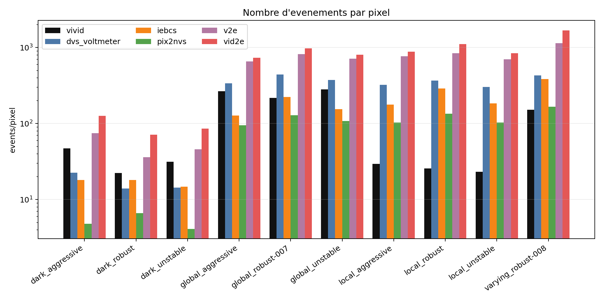
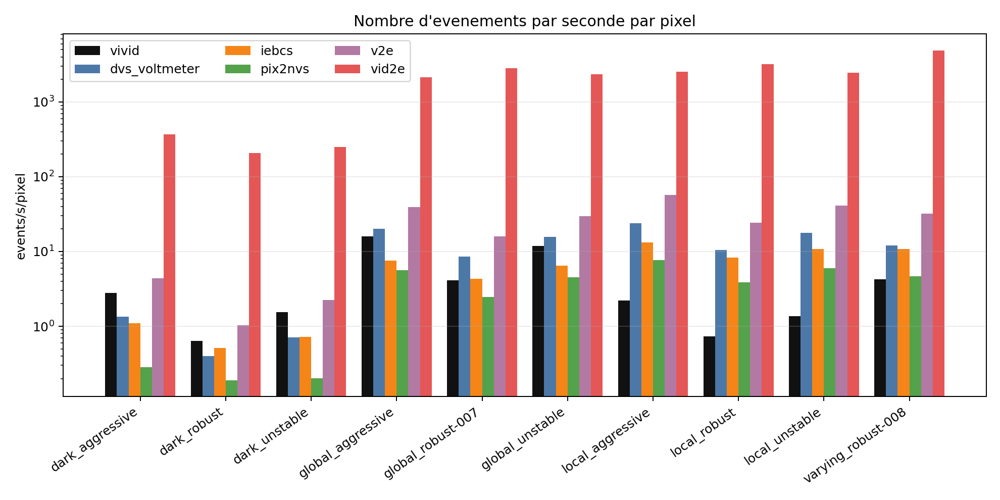
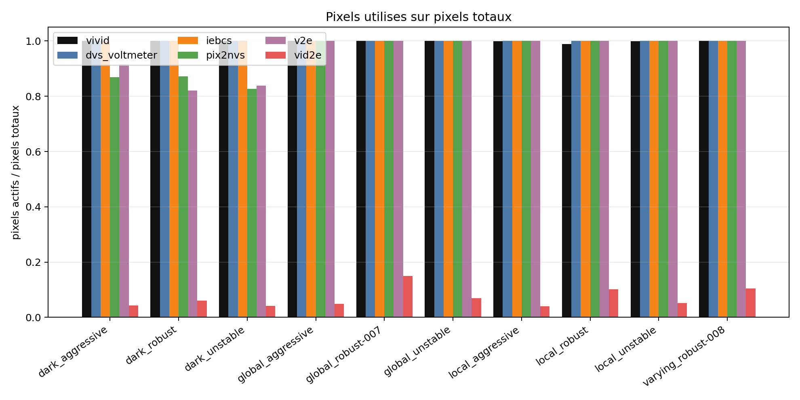
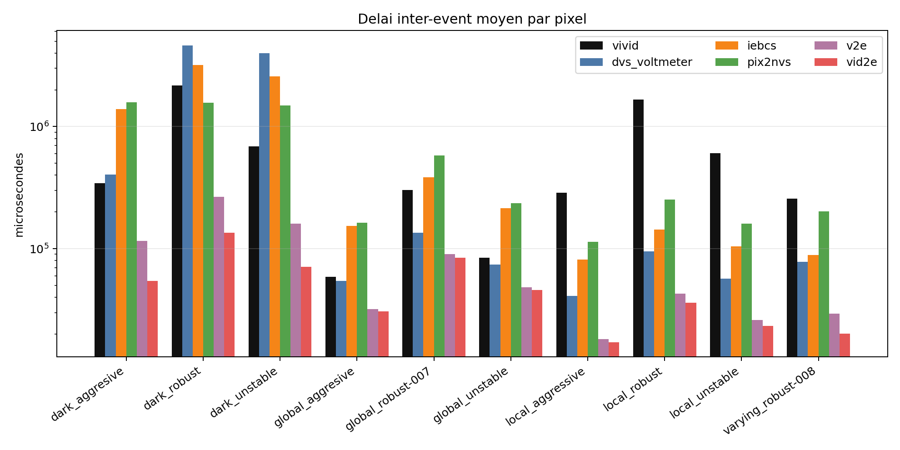
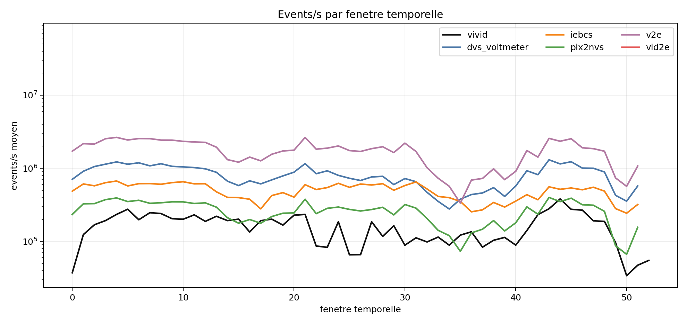
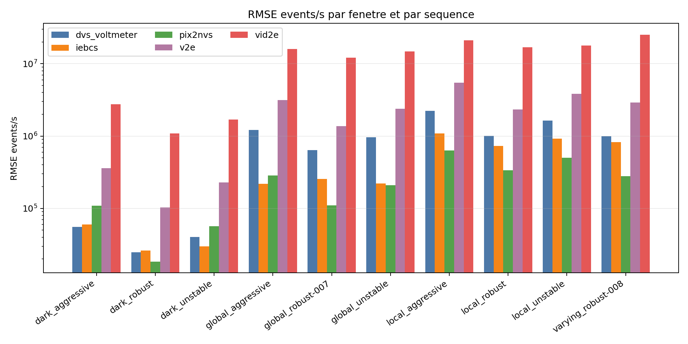

# Comparaison DVS réel / simulateurs avec ViViD++

Ce projet prépare des séquences ViViD++, lance plusieurs simulateurs video-to-event, convertit les sorties dans un format AER commun, puis compare les événements simulés aux événements réels ViViD++.

Objectif général :

```text
RGB ViViD++ -> simulateurs -> événements simulés
DVS ViViD++ -> événements réels de référence
comparaison réel vs simulé
```

## Format AER commun

Le format final utilisé dans le projet est un fichier `.npz` contenant quatre tableaux:

```text
x, y, t, p
```

avec :

```text
x = coordonnée horizontale
y = coordonnée verticale
t = temps en secondes
p = polarité, avec 0 = OFF et 1 = ON
```

Le script de comparaison attend ce format AER strict. Les conversions doivent donc produire `x,y,t,p` avec `t` en secondes avant l'analyse.

## Architecture

```text
.
|-- README.md
|-- requirements.txt
|-- environment.yml
|-- config/
|   `-- pipeline_config.example.yaml
|-- dataset_pipeline/
|-- run_vivid_event_pipeline.py
|-- adapters/
|-- scripts/
|   |-- 00_check_project.py
|   |-- 02_convert_simulator_outputs_to_aer_npz.py
|   |-- 03_prepare_vivid_real_events_to_aer_npz.py
|   `-- run_clear_fundamental_comparison.py
|-- comparaison/
|   |-- figures/
|   |-- results/
|   |-- scripts/
|   `-- requirements.txt
|-- data/
|-- external/
`-- runs/
```

## Installation Linux

Avec conda :

```bash
conda env create -f environment.yml
conda activate vivid-dvs-comparison
```

Avec pip :

```bash
python -m pip install -r requirements.txt
```

Installer aussi FFmpeg :

```bash
sudo apt install ffmpeg
```

Les simulateurs externes ne sont pas inclus dans ce dépôt. Ils doivent être installés séparément, idéalement dans `external/`:

```text
external/
|-- v2e/
|-- rpg_vid2e/
|-- IEBCS/
|-- DVS-Voltmeter/
`-- PIX2NVS/
```

Les chemins des simulateurs sont ensuite à renseigner dans :

```text
config/pipeline_config.yaml
```

## Configuration

Créer la configuration locale :

```bash
cp config/pipeline_config.example.yaml config/pipeline_config.yaml
```

Puis adapter les chemins, les interpréteurs Python et les paramètres de chaque simulateur dans :

```text
config/pipeline_config.yaml
```

Dans `general.timestamp_unit`, indiquer l'unité des timestamps RGB lus pendant la préparation des séquences. Pour les sorties de `dataset_pipeline`, l'unité attendue est `s`.

Quand c'est possible, il est préférable de régler la résolution directement dans les simulateurs pour travailler avec un capteur comparable. Dans l'analyse actuelle, VIVID est lu en `240x180` et les simulateurs en `346x260` ; `events/pixel` corrige une partie de cet écart, mais pas tous les effets de géométrie ou de champ de vue.

## Données et dossiers

Données brutes :

```text
data/raw_bags/
`-- sequence.bag
```

Dataset extrait :

```text
data/outputs/<sequence>/
|-- frames_rgb/
|-- events/
|-- timestamps/
`-- videos/
```

Sorties brutes des simulateurs :

```text
runs/simulated_events/
|-- v2e/
|-- vid2e/
|-- iebcs/
|-- dvs_voltmeter/
`-- pix2nvs/
```

Format AER unifié :

```text
runs/aer_npz/
|-- vivid/
|-- v2e/
|-- vid2e/
|-- iebcs/
|-- dvs_voltmeter/
`-- pix2nvs/
```

Comparaison versionnée dans ce dépôt :

```text
comparaison/
|-- figures/
|   |-- 01_events_per_second.png
|   |-- 02_events_per_pixel.png
|   |-- 03_on_fraction.png
|   |-- 04_active_pixel_fraction.png
|   |-- 05_delay_inter_event_per_pixel.png
|   |-- 06_events_per_second_by_temporal_window.png
|   |-- 07_events_per_second_per_pixel.png
|   `-- 08_temporal_rmse_by_sequence.png
|-- results/
|   |-- metrics_by_sequence.csv
|   |-- events_per_second_by_window.csv
|   |-- temporal_rmse_by_sequence.csv
|   |-- summary.csv
|   |-- summary_by_condition.csv
|   |-- summary_by_regime.csv
|   |-- closest_global.csv
|   |-- closest_by_condition.csv
|   |-- closest_by_regime.csv
|   `-- validation.csv
`-- requirements.txt
```

## Pipeline dataset ViViD++

Cette étape transforme les fichiers `.bag` ViViD++ en une structure simple utilisable par les simulateurs.

```bash
python dataset_pipeline/run_pipeline.py data/raw_bags --out data/outputs
```

Le script principal lance successivement :

```text
extract_rgb.py
extract_events.py
frames_to_video.py
```

Sorties importantes :

```text
frames_rgb/
timestamps/rgb_timestamps.txt
events/events_xytp_000000.npz
videos/rgb.mp4
```

Pour inspecter les topics d'un bag :

```bash
python dataset_pipeline/inspect_bag.py data/raw_bags/sequence.bag
```

Les topics peuvent aussi être fixés manuellement :

```bash
python dataset_pipeline/run_pipeline.py data/raw_bags/sequence.bag \
  --out data/outputs \
  --rgb_topic /camera/image_color \
  --event_topic /dvs/events
```

## Simulation

Préparer les séquences :

```bash
python run_vivid_event_pipeline.py --config config/pipeline_config.yaml --prepare
```

Lancer tous les simulateurs activés dans la configuration :

```bash
python run_vivid_event_pipeline.py --config config/pipeline_config.yaml --run all
```

Dans la configuration exemple, Vid2E est désactivé par défaut car il dépend de `esim_py` dans l'environnement Python associé à `rpg_vid2e`. Le wrapper local est fourni dans `adapters/run_vid2e_esim_py_sequence.py`.

Lancer un seul simulateur :

```bash
python run_vivid_event_pipeline.py --config config/pipeline_config.yaml --run iebcs
```

Entrées utilisées par simulateur :

```text
v2e           : video.mp4
Vid2E         : frames RGB via adapters/run_vid2e_esim_py_sequence.py et esim_py
IEBCS         : frames RGB + timestamps_us.txt via adapters/run_iebcs_sequence.py
DVS-Voltmeter : frames RGB + info.txt
PIX2NVS       : video.mp4, avec compilation C++ possible selon l'installation
```

## Conversion au format commun

Convertir les sorties des simulateurs :

```bash
python scripts/02_convert_simulator_outputs_to_aer_npz.py \
  --sim-root runs/simulated_events \
  --out-root runs/aer_npz \
  --overwrite
```

La conversion n'utilise pas de détection automatique d'unité temporelle. Les unités sont fixées par simulateur, selon les formats utilisés dans la pipeline :

```text
v2e           : secondes
Vid2E         : secondes
IEBCS         : microsecondes
DVS-Voltmeter : microsecondes
PIX2NVS       : microsecondes
```

Si une installation particulière documente une autre unité, elle doit être indiquée explicitement, par exemple :

```bash
python scripts/02_convert_simulator_outputs_to_aer_npz.py \
  --sim-root runs/simulated_events \
  --out-root runs/aer_npz \
  --time-unit v2e=s \
  --time-unit pix2nvs=us \
  --overwrite
```

Préparer les événements réels ViViD++ :

```bash
python scripts/03_prepare_vivid_real_events_to_aer_npz.py \
  --vivid-root data/outputs \
  --aer-npz-root runs/aer_npz \
  --time-unit s \
  --overwrite \
  --sort-final
```

Les événements VIVID issus de `dataset_pipeline` sont déjà en secondes. Si une autre source VIVID est utilisée, l'unité doit être indiquée explicitement avec `--time-unit`.

## Comparaison fondamentale

Le script officiel de comparaison est :

```text
scripts/run_clear_fundamental_comparison.py
```

Commande :

```bash
python scripts/run_clear_fundamental_comparison.py runs/aer_npz runs/comparison
```

Ce script régénère uniquement les CSV et les figures. Il ne régénère pas le rapport Markdown.

Métriques principales :

```text
events/s = n_events / durée
events/pixel = n_events / (largeur * hauteur)
events/s/pixel = nombre d'événements par seconde par pixel = n_events / (durée * largeur * hauteur)
ON ratio = n_ON / n_events
pixels utilisés = pixels_actifs / pixels_totaux
```

Contrôles temporels :

```text
délai_pixel = (t_dernier - t_premier) / (n_events_pixel - 1)
events/s par fenêtre temporelle
```

Le délai inter-événement est calculé pixel par pixel, uniquement pour les pixels ayant au moins deux événements.
Le script produit aussi `temporal_rmse_by_sequence.csv` pour vérifier que la RMSE temporelle globale ne cache pas une séquence mal reproduite.


## Rapport de comparaison final

### Résumé scientifique

Ce rapport compare les événements réels de VIVID avec cinq simulateurs vidéo-vers-événements : `dvs_voltmeter`, `iebcs`, `pix2nvs`, `v2e` et `vid2e`. VIVID est utilisé comme référence expérimentale, mais pas comme vérité absolue : l'objectif est d'observer quels simulateurs reproduisent le mieux certaines propriétés mesurables du flux DVS.

La conclusion principale est volontairement prudente. Aucun simulateur ne reproduit toutes les propriétés de VIVID en même temps. `pix2nvs` est globalement le moins éloigné pour le volume d'événements et la densité temporelle normalisée (`events/s`, `events/pixel`, `events/s/pixel`). `dvs_voltmeter` est le plus proche pour le délai inter-event moyen par pixel et pour la couverture du capteur. `iebcs` est souvent intéressant pour le ratio ON. `v2e` et `vid2e` produisent ici une activité beaucoup plus dense que VIVID, ce qui les éloigne des métriques de volume dans cette configuration.

### Données comparées

Les données comparées sont les fichiers AER unifiés en `.npz`. Chaque fichier contient `x`, `y`, `t`, `p`, `width`, `height` et une unité temporelle commune. Les séquences sont appariées par nom : une séquence simulateur est comparée uniquement à la même séquence VIVID.

- Nombre de fichiers analysés : 60.
- Nombre de fichiers invalides : 0.
- Fichiers avec timestamps non monotones sur toute la séquence : 0.
- Résolution VIVID : `240x180`.
- Résolution des simulateurs dans cette analyse : `346x260`.

Les contrôles de validité vérifient que `x`, `y`, `t` et `p` ont la même longueur, que les coordonnées restent dans les bornes du capteur, que les polarités sont valides et que les timestamps sont monotones. La monotonie est vérifiée par blocs pour rester efficace sur les grands fichiers.

### Principe de comparaison

Les métriques de comparaison avec VIVID sont calculées de façon appariée. Le script ne fait pas simplement `moyenne_simulateur / moyenne_VIVID`. Il calcule d'abord le ratio simulateur/VIVID pour chaque séquence, puis il moyenne ces ratios. C'est plus propre scientifiquement, car une séquence très dense ne doit pas dominer toute la conclusion.

Extrait du script :

```python
def paired_ratio_mean(sim_rows, vivid_rows, metric):
    vivid_by_sequence = rows_by_sequence(vivid_rows)
    values = []
    for row in sim_rows:
        ref = vivid_by_sequence.get(row["sequence"])
        if ref is not None:
            values.append(ratio(row[metric], ref[metric]))
    return mean(values)
```

Pour les fractions, comme le ratio ON ou les pixels utilisés, le script calcule plutôt un écart en points de pourcentage. Un écart de `+8 pp` signifie par exemple que le simulateur a 8 points de pourcentage de plus que VIVID.

### Métriques calculées

Les métriques suivantes sont calculées directement dans `scripts/run_clear_fundamental_comparison.py`. L'extrait ci-dessous montre le bloc principal utilisé pour les mesures de volume, de polarité et de couverture spatiale.

```python
duration_s = max((int(t_us.max()) - int(t_us.min())) / 1_000_000.0, 1e-12)
pixel_id = y.astype(np.int64) * width + x.astype(np.int64)
active_pixels = int(np.unique(pixel_id).size) if n_events else 0
n_on = int(np.sum(p > 0)) if n_events else 0

metrics = {
    "events_per_second": n_events / duration_s if n_events else np.nan,
    "events_per_pixel": n_events / total_pixels if total_pixels else np.nan,
    "events_per_second_per_pixel": (
        n_events / duration_s / total_pixels if n_events and total_pixels else np.nan
    ),
    "on_fraction": n_on / n_events if n_events else np.nan,
    "active_pixel_fraction": active_pixels / total_pixels if total_pixels else np.nan,
}
```

#### Nombre d'événements par seconde

Formule : `events/s = n_events / durée`.

Cette métrique mesure le volume temporel d'événements produit par une source. Elle est utile pour savoir si un simulateur produit globalement trop ou pas assez d'événements par rapport à VIVID. Elle est affichée en échelle logarithmique, car les écarts vont de quelques fois VIVID à plusieurs ordres de grandeur.

Résultat : VIVID produit en moyenne `1.95e+05` events/s. Le simulateur globalement le moins éloigné est `pix2nvs`, avec un ratio moyen de `3.350` par rapport à VIVID. Cela reste supérieur à VIVID : même le meilleur simulateur produit donc davantage d'événements que la référence.


#### Nombre d'événements par pixel

Formule : `events/pixel = n_events / (width * height)`.

Cette métrique corrige l'effet de la résolution. Elle est nécessaire ici parce que VIVID et les simulateurs ne sont pas à la même résolution. Sans cette correction, un simulateur avec plus de pixels peut paraître plus actif simplement parce que son capteur simulé est plus grand.

Résultat : `pix2nvs` est le moins éloigné avec un ratio moyen de `1.610`. Cette métrique montre que la normalisation par résolution réduit fortement certains écarts, mais elle ne corrige pas encore la durée.



#### Nombre d'événements par seconde par pixel

Formule : `events/s/pixel = n_events / (durée * width * height)`.

Cette métrique est la plus propre pour comparer la densité événementielle entre sources de résolutions et de durées potentiellement différentes. Elle normalise à la fois par le temps et par le nombre total de pixels. C'est donc une métrique centrale pour comparer VIVID avec des simulateurs qui ne sortent pas exactement au même format spatial.

Résultat : `pix2nvs` est le moins éloigné de VIVID avec un ratio moyen de `1.609`. L'écart reste toutefois visible : le simulateur le plus proche reste environ `1.609` fois au-dessus de VIVID en densité temporelle par pixel.



#### Ratio ON

Formule : `ON ratio = n_ON / n_events`.

Le ratio ON mesure la proportion d'événements positifs. Dans un flux DVS, cette valeur donne une indication sur l'équilibre entre augmentations et diminutions de luminance. Elle ne suffit pas à juger un simulateur, mais elle permet de voir si la polarité produite est cohérente avec la référence.

Résultat : VIVID a un ratio ON moyen de `42.4%`. `iebcs` est le moins éloigné globalement, avec un écart moyen de `7.151` points de pourcentage. La plupart des simulateurs se rapprochent de `50%`, alors que VIVID est plus déséquilibré. Cela suggère que les modèles ou paramètres utilisés reproduisent mal une partie de l'asymétrie ON/OFF observée dans les données réelles.


#### Pixels utilisés

Formule : `pixels utilisés = pixels_actifs / pixels_totaux`.

Cette métrique indique quelle fraction du capteur reçoit au moins un événement. Elle donne une lecture simple de la couverture spatiale sans faire une analyse de carte d'activité complète. Elle est utile pour distinguer un simulateur qui active tout le capteur d'un simulateur qui concentre beaucoup d'événements sur peu de pixels.

Résultat : VIVID active presque tout le capteur dans ces séquences. `dvs_voltmeter` est le moins éloigné, avec un écart moyen de `0.126` point de pourcentage. `vid2e` est particulier : il produit beaucoup d'événements, mais sur une fraction très faible des pixels, ce qui indique une activité spatialement très concentrée dans cette configuration.



#### Délai inter-event par pixel

Le délai inter-event est calculé pixel par pixel, pas globalement. Pour chaque pixel ayant au moins deux événements, le script calcule :

`délai_pixel = (t_dernier - t_premier) / (n_events_pixel - 1)`

Ensuite, il moyenne les délais des pixels valides. Cette définition évite qu'une région très active domine un délai global calculé sur tout le flux.

Extrait du script :

```python
counts = np.bincount(pixel_id, minlength=total_pixels)
valid = counts > 1

t_min = np.full(total_pixels, np.iinfo(np.int64).max, dtype=np.int64)
t_max = np.zeros(total_pixels, dtype=np.int64)
np.minimum.at(t_min, pixel_id, t_us)
np.maximum.at(t_max, pixel_id, t_us)

delay = (t_max[valid] - t_min[valid]) / (counts[valid] - 1)
delay = delay[delay > 0]
pixels_with_delay = int(valid.sum())
```

Résultat : `dvs_voltmeter` est le moins éloigné de VIVID, avec un ratio moyen de `1.193`. `v2e` et `vid2e` ont des délais beaucoup plus courts, ce qui est cohérent avec leur forte production d'événements. Leur proximité ponctuelle sur certaines conditions ne doit donc pas être interprétée seule : un bon délai peut venir d'une dynamique trop dense plutôt que d'une reproduction fidèle de VIVID.



#### Events/s par fenêtre temporelle et RMSE

Les moyennes globales ne disent pas si les événements arrivent au même moment. Le script découpe donc chaque séquence en fenêtres temporelles, calcule les `events/s` dans chaque fenêtre, puis compare les courbes simulateur/VIVID par RMSE.

Extrait du script :

```python
counts, edges = np.histogram(t_s, bins=n_bins, range=(0, n_bins * window_s))
"events_per_second_window": float(count / window_s)

n = max(len(cur_values), len(vivid_values))
cur_arr = np.zeros(n, dtype=np.float64)
vivid_arr = np.zeros(n, dtype=np.float64)
cur_arr[: len(cur_values)] = cur_values
vivid_arr[: len(vivid_values)] = vivid_values
rmse = float(np.sqrt(np.mean((cur_arr - vivid_arr) ** 2)))
```

Les fenêtres absentes sont remplies avec une activité nulle. Cela évite de tronquer les courbes à la plus courte durée et permet de pénaliser un simulateur qui s'arrête trop tôt ou continue trop longtemps.

Résultat : `pix2nvs` obtient la RMSE temporelle moyenne la plus faible (`2.54e+05`). Cela signifie que ses variations d'activité par fenêtre sont les moins éloignées de VIVID en moyenne, mais cette métrique reste sensible au volume total d'événements.



La RMSE est aussi calculée séquence par séquence pour éviter qu'une bonne moyenne masque une mauvaise reproduction locale.

| Séquence | Meilleure RMSE temporelle | RMSE | fenêtres comparées |
| --- | --- | --- | --- |
| dark_aggressive | dvs_voltmeter | 5.56e+04 | 17 |
| dark_robust | pix2nvs | 1.84e+04 | 36 |
| dark_unstable | iebcs | 3.00e+04 | 21 |
| global_aggressive | iebcs | 2.19e+05 | 17 |
| global_robust-007 | pix2nvs | 1.10e+05 | 53 |
| global_unstable | pix2nvs | 2.09e+05 | 24 |
| local_aggressive | pix2nvs | 6.30e+05 | 14 |
| local_robust | pix2nvs | 3.36e+05 | 36 |
| local_unstable | pix2nvs | 5.04e+05 | 18 |
| varying_robust-008 | pix2nvs | 2.78e+05 | 36 |



### Résultats globaux

| Source | events/s | events/pixel | events/s/pixel | ratio ON | pixels utilisés | délai/pixel | pixels avec délai | events/s vs VIVID | events/pixel vs VIVID | events/s/pixel vs VIVID | délai vs VIVID | RMSE fenêtres |
| --- | --- | --- | --- | --- | --- | --- | --- | --- | --- | --- | --- | --- |
| vivid | 1.95e+05 | 109.7 | 4.52e+00 | 42.4% | 99.9% | 6.47e+05 | 99.6% | 1.000 | 1.000 | 1.000 | 1.000 | 0.000 |
| dvs_voltmeter | 9.99e+05 | 262.5 | 1.11e+01 | 53.7% | 100.0% | 9.55e+05 | 98.2% | 9.862 | 4.724 | 4.736 | 1.193 | 8.82e+05 |
| iebcs | 5.74e+05 | 159.5 | 6.38e+00 | 49.5% | 100.0% | 8.33e+05 | 99.7% | 6.558 | 3.142 | 3.149 | 1.655 | 4.38e+05 |
| pix2nvs | 3.19e+05 | 85.48 | 3.55e+00 | 49.7% | 95.7% | 6.35e+05 | 92.8% | 3.350 | 1.610 | 1.609 | 1.656 | 2.54e+05 |
| v2e | 2.22e+06 | 580.8 | 2.46e+01 | 50.2% | 95.7% | 8.29e+04 | 95.0% | 22.876 | 10.998 | 10.986 | 0.235 | 2.22e+06 |
| vid2e | 1.91e+08 | 731.2 | 2.12e+03 | 50.1% | 7.1% | 1.19e+02 | 7.1% | 2.11e+03 | 13.898 | 1.01e+03 | 0.000 | 1.29e+07 |

Le tableau global montre trois tendances fortes. Premièrement, `pix2nvs` est le plus proche sur les métriques de volume, mais reste au-dessus de VIVID. Deuxièmement, `dvs_voltmeter` est plus cohérent sur la couverture spatiale et le délai moyen par pixel. Troisièmement, `v2e` et `vid2e` génèrent beaucoup plus d'activité que VIVID dans cette configuration, ce qui les rend difficiles à considérer comme proches sans recalibrage des paramètres.

Critère de proximité appliqué globalement :

| Métrique | Plus proche | Valeur | Distance | Critère |
| --- | --- | --- | --- | --- |
| events/s | pix2nvs | 3.350 | 2.350 | abs(ratio - 1) |
| events/pixel | pix2nvs | 1.610 | 0.610 | abs(ratio - 1) |
| events/s/pixel | pix2nvs | 1.609 | 0.609 | abs(ratio - 1) |
| délai | dvs_voltmeter | 1.193 | 0.193 | abs(ratio - 1) |
| ratio ON | iebcs | 7.151 | 7.151 | abs(diff_pp) |
| pixels utilisés | dvs_voltmeter | 0.126 | 0.126 | abs(diff_pp) |

### Analyse par séquence

Cette lecture vérifie que les conclusions globales ne viennent pas d'une seule moyenne. Les valeurs entre parenthèses sont des ratios par rapport à VIVID pour `events/s`, `events/pixel`, `events/s/pixel` et le délai. Pour `ON` et `pixels utilisés`, ce sont des écarts en points de pourcentage.

| Séquence | events/s plus proche | events/pixel plus proche | events/s/pixel plus proche | délai plus proche | ON plus proche | pixels plus proche |
| --- | --- | --- | --- | --- | --- | --- |
| dark_aggressive | dvs_voltmeter (0.998) | dvs_voltmeter (0.479) | dvs_voltmeter (0.479) | dvs_voltmeter (1.175) | pix2nvs (9.203 pp) | iebcs (0.000 pp) |
| dark_robust | dvs_voltmeter (1.305) | iebcs (0.809) | iebcs (0.810) | pix2nvs (0.726) | pix2nvs (7.070 pp) | dvs_voltmeter (0.007 pp) |
| dark_unstable | iebcs (0.980) | v2e (1.462) | v2e (1.459) | v2e (0.233) | pix2nvs (8.161 pp) | dvs_voltmeter (0.000 pp) |
| global_aggressive | iebcs (0.999) | dvs_voltmeter (1.266) | dvs_voltmeter (1.271) | dvs_voltmeter (0.920) | iebcs (5.555 pp) | dvs_voltmeter (0.000 pp) |
| global_robust-007 | pix2nvs (1.251) | iebcs (1.034) | iebcs (1.049) | iebcs (1.273) | iebcs (6.523 pp) | dvs_voltmeter (0.000 pp) |
| global_unstable | iebcs (1.150) | dvs_voltmeter (1.326) | dvs_voltmeter (1.327) | dvs_voltmeter (0.880) | iebcs (6.422 pp) | dvs_voltmeter (0.000 pp) |
| local_aggressive | pix2nvs (7.244) | pix2nvs (3.480) | pix2nvs (3.479) | pix2nvs (0.396) | iebcs (1.951 pp) | dvs_voltmeter (0.097 pp) |
| local_robust | pix2nvs (10.895) | pix2nvs (5.245) | pix2nvs (5.232) | pix2nvs (0.151) | iebcs (-0.869 pp) | dvs_voltmeter (1.044 pp) |
| local_unstable | pix2nvs (9.177) | pix2nvs (4.415) | pix2nvs (4.407) | pix2nvs (0.263) | iebcs (0.988 pp) | dvs_voltmeter (0.125 pp) |
| varying_robust-008 | pix2nvs (2.286) | pix2nvs (1.098) | pix2nvs (1.098) | pix2nvs (0.786) | iebcs (11.969 pp) | dvs_voltmeter (0.000 pp) |

Interprétation synthétique :

- Les séquences `dark` sont celles où le choix de métrique change le plus la conclusion. `dvs_voltmeter` peut être très proche en `events/s`, mais `iebcs` devient moins éloigné lorsque l'on normalise par pixel et par durée. Cela suggère que la gestion du bruit, des seuils et de la résolution influence fortement ces scènes.
- Les séquences `global` sont plus équilibrées. `pix2nvs` suit mieux le volume temporel, alors que `iebcs` est souvent plus proche après correction par pixel. Cette différence indique que le volume total et la densité spatiale ne racontent pas exactement la même chose.
- Les séquences `local` sont les plus difficiles. Même le simulateur le moins éloigné produit plusieurs fois l'activité de VIVID. La conclusion raisonnable n'est pas qu'un simulateur est excellent sur `local`, mais plutôt que tous les simulateurs sur-produisent dans ces conditions.
- `varying_robust-008` doit être lue avec prudence, car la condition `varying` ne contient qu'une seule séquence.

### Analyse par condition

Les conditions permettent de séparer les comportements selon le type de scène. La colonne `n` indique le nombre de séquences disponibles ; les conclusions avec `n=1` sont indicatives seulement.

| Condition | Source | n | events/s vs VIVID | events/pixel vs VIVID | events/s/pixel vs VIVID | ON diff pp | pixels diff pp | délai vs VIVID |
| --- | --- | --- | --- | --- | --- | --- | --- | --- |
| dark | vivid | 3 | 1.000 | 1.000 | 1.000 | 0.000 | 0.000 | 1.000 |
| dark | dvs_voltmeter | 3 | 1.086 | 0.521 | 0.522 | 15.793 | -0.002 | 3.028 |
| dark | iebcs | 3 | 1.163 | 0.554 | 0.558 | 12.990 | 0.002 | 3.088 |
| dark | pix2nvs | 3 | 0.368 | 0.177 | 0.177 | 8.145 | -14.415 | 2.495 |
| dark | v2e | 3 | 3.227 | 1.553 | 1.550 | 9.097 | -14.205 | 0.231 |
| dark | vid2e | 3 | 429.008 | 2.869 | 206.015 | 8.667 | -95.142 | 0.000 |
| global | vivid | 3 | 1.000 | 1.000 | 1.000 | 0.000 | 0.000 | 1.000 |
| global | dvs_voltmeter | 3 | 3.230 | 1.540 | 1.551 | 11.312 | 0.000 | 0.749 |
| global | iebcs | 3 | 1.444 | 0.688 | 0.694 | 6.167 | 0.000 | 2.134 |
| global | pix2nvs | 3 | 0.930 | 0.444 | 0.447 | 8.093 | 0.000 | 2.491 |
| global | v2e | 3 | 6.124 | 2.928 | 2.941 | 8.300 | 0.000 | 0.470 |
| global | vid2e | 3 | 705.776 | 3.364 | 338.923 | 8.277 | -91.040 | 0.001 |
| local | vivid | 3 | 1.000 | 1.000 | 1.000 | 0.000 | 0.000 | 1.000 |
| local | dvs_voltmeter | 3 | 26.589 | 12.742 | 12.768 | 5.164 | 0.422 | 0.098 |
| local | iebcs | 3 | 17.486 | 8.384 | 8.397 | 0.690 | 0.422 | 0.180 |
| local | pix2nvs | 3 | 9.105 | 4.380 | 4.372 | 3.673 | 0.422 | 0.270 |
| local | v2e | 3 | 61.684 | 29.670 | 29.621 | 3.515 | 0.422 | 0.044 |
| local | vid2e | 3 | 5.09e+03 | 36.399 | 2.44e+03 | 3.543 | -93.123 | 0.000 |
| varying | vivid | 1 | 1.000 | 1.000 | 1.000 | 0.000 | 0.000 | 1.000 |
| varying | dvs_voltmeter | 1 | 5.901 | 2.829 | 2.834 | 16.563 | 0.000 | 0.303 |
| varying | iebcs | 1 | 5.297 | 2.540 | 2.544 | 11.969 | 0.000 | 0.346 |
| varying | pix2nvs | 1 | 2.286 | 1.098 | 1.098 | 13.870 | 0.000 | 0.786 |
| varying | v2e | 1 | 15.657 | 7.522 | 7.519 | 15.403 | 0.000 | 0.114 |
| varying | vid2e | 1 | 2.39e+03 | 11.079 | 1.15e+03 | 15.385 | -89.595 | 0.000 |

Meilleurs simulateurs par condition :

| Condition | Métrique | Plus proche | Valeur | Distance | Critère |
| --- | --- | --- | --- | --- | --- |
| dark | events/s | dvs_voltmeter | 1.086 | 0.086 | abs(ratio - 1) |
| dark | events/pixel | iebcs | 0.554 | 0.446 | abs(ratio - 1) |
| dark | events/s/pixel | iebcs | 0.558 | 0.442 | abs(ratio - 1) |
| dark | délai | v2e | 0.231 | 0.769 | abs(ratio - 1) |
| dark | ratio ON | pix2nvs | 8.145 | 8.145 | abs(diff_pp) |
| dark | pixels utilisés | dvs_voltmeter | -0.002 | 0.002 | abs(diff_pp) |
| global | events/s | pix2nvs | 0.930 | 0.070 | abs(ratio - 1) |
| global | events/pixel | iebcs | 0.688 | 0.312 | abs(ratio - 1) |
| global | events/s/pixel | iebcs | 0.694 | 0.306 | abs(ratio - 1) |
| global | délai | dvs_voltmeter | 0.749 | 0.251 | abs(ratio - 1) |
| global | ratio ON | iebcs | 6.167 | 6.167 | abs(diff_pp) |
| global | pixels utilisés | dvs_voltmeter | 0.000 | 0.000 | abs(diff_pp) |
| local | events/s | pix2nvs | 9.105 | 8.105 | abs(ratio - 1) |
| local | events/pixel | pix2nvs | 4.380 | 3.380 | abs(ratio - 1) |
| local | events/s/pixel | pix2nvs | 4.372 | 3.372 | abs(ratio - 1) |
| local | délai | pix2nvs | 0.270 | 0.730 | abs(ratio - 1) |
| local | ratio ON | iebcs | 0.690 | 0.690 | abs(diff_pp) |
| local | pixels utilisés | dvs_voltmeter | 0.422 | 0.422 | abs(diff_pp) |
| varying | events/s | pix2nvs | 2.286 | 1.286 | abs(ratio - 1) |
| varying | events/pixel | pix2nvs | 1.098 | 0.098 | abs(ratio - 1) |
| varying | events/s/pixel | pix2nvs | 1.098 | 0.098 | abs(ratio - 1) |
| varying | délai | pix2nvs | 0.786 | 0.214 | abs(ratio - 1) |
| varying | ratio ON | iebcs | 11.969 | 11.969 | abs(diff_pp) |
| varying | pixels utilisés | dvs_voltmeter | 0.000 | 0.000 | abs(diff_pp) |

Lecture synthétique :

- `dark` : `events/s` -> `dvs_voltmeter` ; `events/pixel` -> `iebcs` ; `events/s/pixel` -> `iebcs` ; `ratio ON` -> `pix2nvs` ; `pixels utilisés` -> `dvs_voltmeter`.
- `global` : `events/s` -> `pix2nvs` ; `events/pixel` -> `iebcs` ; `events/s/pixel` -> `iebcs` ; `ratio ON` -> `iebcs` ; `pixels utilisés` -> `dvs_voltmeter`.
- `local` : `events/s` -> `pix2nvs` ; `events/pixel` -> `pix2nvs` ; `events/s/pixel` -> `pix2nvs` ; `ratio ON` -> `iebcs` ; `pixels utilisés` -> `dvs_voltmeter`.
- `varying` : `events/s` -> `pix2nvs` ; `events/pixel` -> `pix2nvs` ; `events/s/pixel` -> `pix2nvs` ; `ratio ON` -> `iebcs` ; `pixels utilisés` -> `dvs_voltmeter`.

Discussion :

- `dark` : la proximité en `events/s` de `dvs_voltmeter` ne suffit pas à conclure qu'il est globalement le meilleur. En densité normalisée (`events/s/pixel`), `iebcs` est moins éloigné, mais il reste sous VIVID. Le résultat indique surtout que les paramètres liés au bruit et aux seuils sont déterminants dans les scènes sombres.
- `global` : `pix2nvs` est proche en volume temporel (`0.930`), mais `iebcs` est plus proche en densité par pixel (`0.694`). Cette différence montre l'intérêt d'utiliser plusieurs métriques : une bonne correspondance globale peut cacher une densité spatiale différente.
- `local` : tous les simulateurs produisent trop d'événements. Même `pix2nvs`, le moins éloigné, reste à `4.372` fois VIVID en `events/s/pixel`. Cette condition est donc la plus critique pour la fidélité.
- `varying` : `pix2nvs` est proche en `events/pixel` et `events/s/pixel`, mais la condition n'a que `n=1`. Il faut la considérer comme une observation, pas comme une tendance robuste.

### Analyse par régime

Les régimes `aggressive`, `robust` et `unstable` donnent une lecture complémentaire des mêmes séquences.

| Régime | Source | n | events/s vs VIVID | events/pixel vs VIVID | events/s/pixel vs VIVID | ON diff pp | pixels diff pp | délai vs VIVID |
| --- | --- | --- | --- | --- | --- | --- | --- | --- |
| aggressive | vivid | 3 | 1.000 | 1.000 | 1.000 | 0.000 | 0.000 | 1.000 |
| aggressive | dvs_voltmeter | 3 | 8.801 | 4.207 | 4.226 | 9.872 | 0.028 | 0.746 |
| aggressive | iebcs | 3 | 4.778 | 2.281 | 2.295 | 6.306 | 0.032 | 2.313 |
| aggressive | pix2nvs | 3 | 2.732 | 1.313 | 1.312 | 7.607 | -4.329 | 2.585 |
| aggressive | v2e | 3 | 20.865 | 10.025 | 10.020 | 7.936 | -2.793 | 0.314 |
| aggressive | vid2e | 3 | 988.422 | 11.702 | 474.653 | 7.835 | -95.548 | 0.001 |
| robust | vivid | 4 | 1.000 | 1.000 | 1.000 | 0.000 | 0.000 | 1.000 |
| robust | dvs_voltmeter | 4 | 10.316 | 4.947 | 4.954 | 12.921 | 0.263 | 0.734 |
| robust | iebcs | 4 | 8.163 | 3.917 | 3.920 | 7.999 | 0.263 | 0.795 |
| robust | pix2nvs | 4 | 3.763 | 1.809 | 1.807 | 7.415 | -2.935 | 0.894 |
| robust | v2e | 4 | 23.846 | 11.461 | 11.451 | 8.149 | -4.221 | 0.140 |
| robust | vid2e | 4 | 3.40e+03 | 15.484 | 1.63e+03 | 8.000 | -89.332 | 0.000 |
| unstable | vivid | 3 | 1.000 | 1.000 | 1.000 | 0.000 | 0.000 | 1.000 |
| unstable | dvs_voltmeter | 3 | 10.317 | 4.944 | 4.955 | 10.692 | 0.042 | 2.250 |
| unstable | iebcs | 3 | 6.196 | 2.969 | 2.976 | 6.865 | 0.042 | 2.145 |
| unstable | pix2nvs | 3 | 3.416 | 1.643 | 1.640 | 7.041 | -5.751 | 1.741 |
| unstable | v2e | 3 | 23.595 | 11.352 | 11.330 | 7.245 | -5.362 | 0.282 |
| unstable | vid2e | 3 | 1.50e+03 | 13.978 | 719.258 | 7.113 | -94.513 | 0.001 |

Meilleurs simulateurs par régime :

| Régime | Métrique | Plus proche | Valeur | Distance | Critère |
| --- | --- | --- | --- | --- | --- |
| aggressive | events/s | pix2nvs | 2.732 | 1.732 | abs(ratio - 1) |
| aggressive | events/pixel | pix2nvs | 1.313 | 0.313 | abs(ratio - 1) |
| aggressive | events/s/pixel | pix2nvs | 1.312 | 0.312 | abs(ratio - 1) |
| aggressive | délai | dvs_voltmeter | 0.746 | 0.254 | abs(ratio - 1) |
| aggressive | ratio ON | iebcs | 6.306 | 6.306 | abs(diff_pp) |
| aggressive | pixels utilisés | dvs_voltmeter | 0.028 | 0.028 | abs(diff_pp) |
| robust | events/s | pix2nvs | 3.763 | 2.763 | abs(ratio - 1) |
| robust | events/pixel | pix2nvs | 1.809 | 0.809 | abs(ratio - 1) |
| robust | events/s/pixel | pix2nvs | 1.807 | 0.807 | abs(ratio - 1) |
| robust | délai | pix2nvs | 0.894 | 0.106 | abs(ratio - 1) |
| robust | ratio ON | pix2nvs | 7.415 | 7.415 | abs(diff_pp) |
| robust | pixels utilisés | dvs_voltmeter | 0.263 | 0.263 | abs(diff_pp) |
| unstable | events/s | pix2nvs | 3.416 | 2.416 | abs(ratio - 1) |
| unstable | events/pixel | pix2nvs | 1.643 | 0.643 | abs(ratio - 1) |
| unstable | events/s/pixel | pix2nvs | 1.640 | 0.640 | abs(ratio - 1) |
| unstable | délai | v2e | 0.282 | 0.718 | abs(ratio - 1) |
| unstable | ratio ON | iebcs | 6.865 | 6.865 | abs(diff_pp) |
| unstable | pixels utilisés | dvs_voltmeter | 0.042 | 0.042 | abs(diff_pp) |

Lecture synthétique :

- `aggressive` : `events/s` -> `pix2nvs` ; `events/pixel` -> `pix2nvs` ; `events/s/pixel` -> `pix2nvs` ; `ratio ON` -> `iebcs` ; `pixels utilisés` -> `dvs_voltmeter`.
- `robust` : `events/s` -> `pix2nvs` ; `events/pixel` -> `pix2nvs` ; `events/s/pixel` -> `pix2nvs` ; `ratio ON` -> `pix2nvs` ; `pixels utilisés` -> `dvs_voltmeter`.
- `unstable` : `events/s` -> `pix2nvs` ; `events/pixel` -> `pix2nvs` ; `events/s/pixel` -> `pix2nvs` ; `ratio ON` -> `iebcs` ; `pixels utilisés` -> `dvs_voltmeter`.

Discussion :

- `aggressive` : `pix2nvs` est le moins éloigné en volume et en densité normalisée, mais `dvs_voltmeter` est plus proche en délai. Cela peut indiquer que le volume d'événements et la dynamique locale ne sont pas calibrés de la même façon.
- `robust` : `pix2nvs` est le simulateur le plus régulier sur les métriques de volume. C'est le régime où son comportement est le plus cohérent avec la référence.
- `unstable` : `pix2nvs` reste le plus proche en volume, mais `v2e` obtient le délai le moins éloigné. Comme `v2e` produit beaucoup plus d'événements que VIVID, ce bon score sur le délai ne suffit pas à le considérer comme globalement fidèle.

### Interprétation générale

Les résultats montrent que la fidélité d'un simulateur DVS ne peut pas être résumée par une seule métrique. Le nombre d'événements par seconde mesure le volume temporel, mais il est sensible aux paramètres de seuil et à la durée. Le nombre d'événements par pixel corrige la résolution, mais pas le temps. `events/s/pixel` est donc plus rigoureux pour comparer des sorties de tailles différentes. Le ratio ON teste l'équilibre de polarité, la fraction de pixels utilisés décrit la couverture spatiale, et le délai par pixel donne une lecture de la dynamique locale.

Dans cette configuration, `pix2nvs` apparaît comme le simulateur le plus sobre et le moins éloigné de VIVID pour les métriques de volume. `dvs_voltmeter` semble mieux préserver certaines propriétés temporelles locales et spatiales. `iebcs` est intéressant pour la polarité. `v2e` et `vid2e` nécessiteraient probablement un recalibrage plus poussé avant d'être comparés directement à VIVID sur ces métriques.

### Limites

- VIVID est une référence réelle, mais pas une vérité absolue. Les écarts observés peuvent venir des simulateurs, des paramètres, des données d'entrée ou du protocole.
- Les résolutions ne sont pas identiques. `events/pixel` et `events/s/pixel` corrigent cet effet dans l'analyse, mais l'idéal reste de régler la résolution directement dans les simulateurs lorsque c'est possible.
- Les simulateurs peuvent utiliser des seuils, modèles de bruit, interpolations et conventions temporelles différents. Sans calibration fine, une comparaison directe reste partielle.
- Les conditions ne sont pas toutes aussi représentées. La condition `varying` ne contient qu'une seule séquence, donc elle ne permet pas une conclusion générale.
- La RMSE temporelle mesure un écart de courbe d'activité, mais elle reste influencée par le volume total d'événements. Elle doit être lue avec les autres métriques.

### Conclusion

Le pipeline fournit maintenant une comparaison sobre et rigoureuse : les données sont validées, les métriques sont calculées de manière explicite, les ratios sont appariés séquence par séquence, et les figures permettent d'interpréter les résultats sans mélanger résolution, durée, polarité et dynamique locale.

La conclusion actuel serait la suivante : `pix2nvs` est le meilleur candidat global pour reproduire le volume d'activité de VIVID dans cette configuration, mais il reste trop actif. `dvs_voltmeter` est plus convaincant sur le délai inter-event par pixel et la couverture du capteur. `iebcs` reste pertinent pour le ratio ON. Aucun simulateur ne peut être déclaré strictement équivalent à VIVID sans calibration supplémentaire.

Il faut toutefois rester prudent, car les simulateurs ont été lancés avec leurs paramètres actuels, sans calibration fine spécifique à ce jeu de données. Une suite logique du travail serait donc d'optimiser leurs paramètres afin de vérifier si la proximité avec VIVID s'améliore sur les différentes métriques utilisées ici. Il serait aussi important d'étudier si certains réglages restent robustes d'une situation à l'autre, notamment lorsque la luminosité, la vitesse de la vidéo ou le type de scène changent. Enfin, l'analyse pourrait être renforcée par des tests statistiques complémentaires, pour quantifier plus précisément la proximité entre les simulateurs et la référence réelle.

### Sources utilisées pour interpréter les simulateurs

- v2e: https://github.com/SensorsINI/v2e
- IEBCS: https://github.com/neuromorphicsystems/IEBCS
- DVS-Voltmeter: https://github.com/Lynn0306/DVS-Voltmeter
- PIX2NVS: https://github.com/PIX2NVS/PIX2NVS
- Vid2E: https://github.com/uzh-rpg/rpg_vid2e
